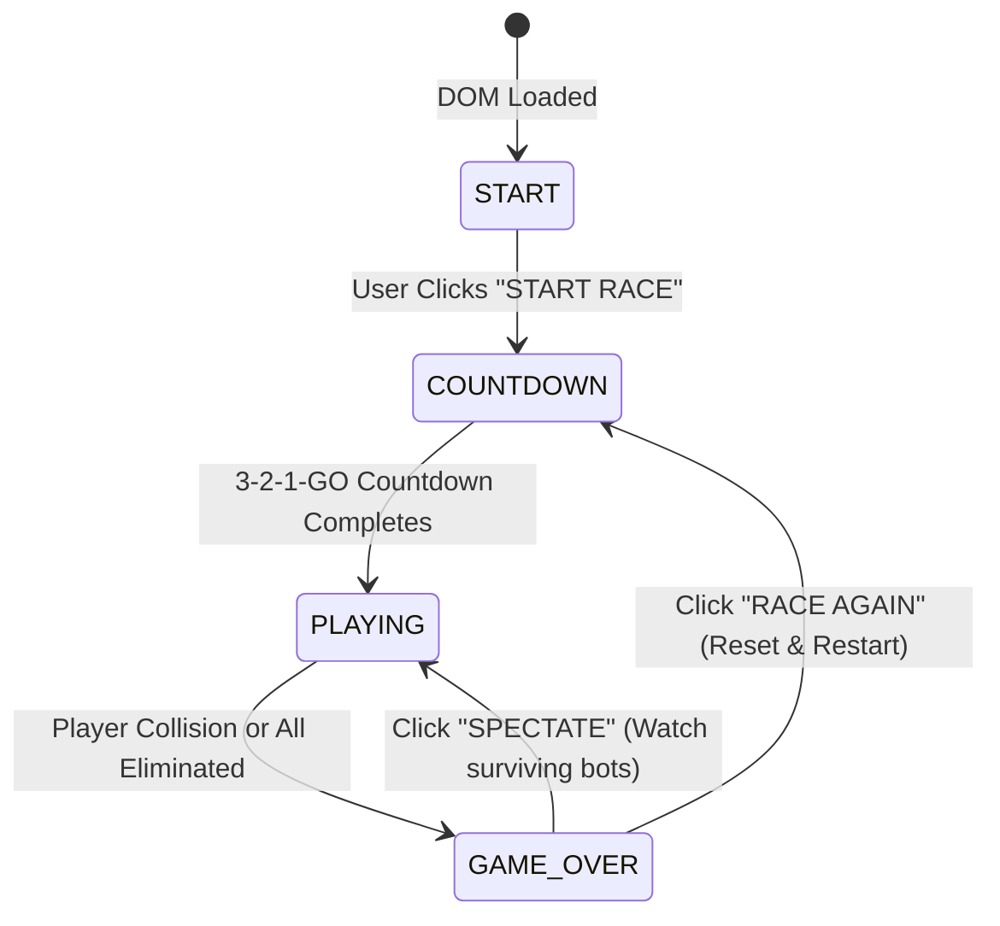
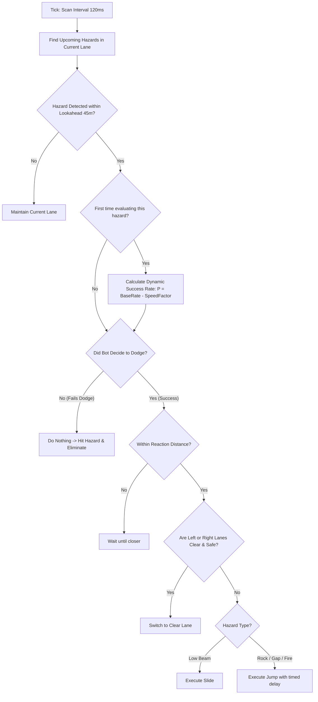

# 📘 Neon Run: Elimination — Technical Documentation & Architecture Walkthrough

This document provides a comprehensive technical reference for the **Neon Run: Elimination** 3D endless runner engine. It covers the game loop, Three.js rendering pipeline, procedural track generation, AI decision algorithms, player physics, procedural audio synthesis, and UI architecture.

---

## 1. System Architecture & Module Overview

The application is structured into decoupled ES6 modules without external bundler dependencies, loading Three.js (r128) via CDN:

```
┌────────────────────────────────────────────────────────────────────────┐
│                              index.html                                │
│          (DOM UI Overlays: Start, HUD, Live Leaderboard, Game Over)     │
└────────────────────────────────────┬───────────────────────────────────┘
                                     │
                        ┌────────────▼────────────┐
                        │      src/game.js        │
                        │    (GameController)     │
                        │  - Three.js Core Scene  │
                        │  - State Machine        │
                        │  - Particle Engine      │
                        │  - Collision Manager    │
                        │  - Camera Trailing      │
                        └───────┬─────┬─────┬─────┘
                                │     │     │
         ┌──────────────────────┘     │     └──────────────────────┐
         ▼                            ▼                            ▼
┌─────────────────┐          ┌─────────────────┐          ┌─────────────────┐
│  src/track.js   │          │  src/runner.js  │          │  src/audio.js   │
│ - TrackManager  │          │ - Runner (Base) │          │ - AudioSynth    │
│ - TrackSegment  │          │ - BotRunner(AI) │          │ - Web Audio API │
│ - Road Curving  │          │ - Physics/Anim  │          │ - SFX & Music   │
│ - Obstacles/Coin│          │ - Collision Box │          │   Generator     │
└─────────────────┘          └─────────────────┘          └─────────────────┘
```

---

## 2. World Coordinate System & Math

The game engine operates on a right-handed 3D Cartesian coordinate system:

- **$+X$ (Right) / $-X$ (Left)**: Lateral lane position.
- **$+Y$ (Up) / $-Y$ (Down)**: Elevation, jump height, and gap falls. Ground level is at $Y = 0$.
- **$-Z$ (Forward) / $+Z$ (Backward)**: Forward running progression. Runners move continuously into negative $Z$.

### Lane Positioning
Three lanes are spaced with a lane width of $W = 3.5\text{ units}$:
- **Left Lane ($0$)**: $X = -3.5$
- **Center Lane ($1$)**: $X = 0.0$
- **Right Lane ($2$)**: $X = +3.5$

### Serpentine Track Curvature Formula
To prevent monotonous straight-line gameplay, the track dynamically curves along the X-axis as $Z$ progresses:

$$\text{TrackCenterX}(Z) = \begin{cases} 0 & \text{if } Z > -100 \\ \sin\Big((Z + 100) \times 0.007\Big) \times 7.5 & \text{if } Z \le -100 \end{cases}$$

Every object (track segments, obstacles, coins, and runners) references `trackManager.getTrackCenterX(z)` to align seamlessly with the sinusoidal road curvature.

---

## 3. Game Controller & Lifecycle (`src/game.js`)

`GameController` orchestrates all subsystems and drives the main requestAnimationFrame loop.

### State Machine



1. **`START`**: Customizer menu open (set player name, select 4/6/9 bots, pick runner color).
2. **`COUNTDOWN`**: 3-second animated pulse countdown with tick sounds and "GO!" chime.
3. **`PLAYING`**: Active simulation loop running physics, AI decisions, collision checks, segment recycling, and audio.
4. **`GAME_OVER`**: Displays victory or elimination modal with race stats (rank, distance, coins, duration). Offers **Spectate** mode if bots are still alive.

### Speed Scaling Progression
The game starts at `baseSpeed = 16.0 units/sec` (2x increased baseline) and scales up every 200 meters run:

$$\text{Speed} = \min\Big(\text{maxSpeed} = 40.0,\; \text{baseSpeed} + \lfloor\text{distance} / 200\rfloor \times 2.0\Big)$$

Whenever a speed milestone is reached, an audio fanfare plays and a HUD banner (`⚡ SPEED UP! MULTIPLIER: X.Xx`) alerts the player.

### Particle Physics Engine
The built-in particle engine manages two categories of visual effects:
- **Collision Explosions (`spawnExplosion`)**: Spawns 25–35 textured cube particles with radial velocity vectors $(\pm 12, +2\dots 10, \pm 12)$, gravity ($g = -9.8$), scale decay, and opacity fade.
- **Running Foot Dust (`spawnDust`)**: Soft smoke particles spawned periodically beneath running characters that blow backward relative to runner velocity.

### Smooth Camera Trailing
The camera implements third-person trailing with exponential dampening (lerp):
- **Target Position**: Follows the active player (or leading bot in Spectator mode):
  - $X_{\text{cam}} = \text{lerp}(X_{\text{cam}}, X_{\text{target}} \times 0.45, 0.1)$
  - $Y_{\text{cam}} = \text{lerp}(Y_{\text{cam}}, Y_{\text{target}} + 4.2, 0.1)$
  - $Z_{\text{cam}} = \text{lerp}(Z_{\text{cam}}, Z_{\text{target}} + 10.5, 0.1)$
- **LookAt Target**: Focuses ahead of the target at $(X \times 0.25, Y \times 0.4 + 0.8, Z - 12)$.
- **Retro Synthwave Sun**: Stays pinned at $Z_{\text{cam}} - 450$ to maintain an infinite horizon illusion.

---

## 4. Track & Obstacle System (`src/track.js`)

### Zero-Allocation Asset Sharing
To prevent garbage collection pauses during high-speed runs, Three.js geometries and materials (`BoxGeometry`, `DodecahedronGeometry`, `CylinderGeometry`, `TorusGeometry`, `MeshPhongMaterial`) are allocated once in `initSharedAssets()` and shared across all procedural segments.

### Segment Recycling Mechanism
- The track consists of 12 contiguous segments of length $L = 50\text{ units}$.
- The first 3 segments are guaranteed safe (no hazards or gaps).
- When a segment falls behind the leading runner ($Z_{\text{leader}} < Z_{\text{seg}} - 60$), it is removed from the scene and a new segment is generated at the front ($Z_{\text{next}} - 50$).

### Hazard Types & Avoidance Strategy

| Hazard | Description | Spawn Logic | Required Avoidance |
| :--- | :--- | :--- | :--- |
| **Floor Gap** | Missing floor tiles across 1 or 2 lanes | Segment type `gap` ($25\%$ chance) | **Jump** or **Lane Switch** |
| **Boulder (`rock`)** | Low-poly dodecahedron rock blocking a lane | Random obstacle in non-gap lane | **Jump** or **Lane Switch** |
| **Low Beam (`low_beam`)** | Cyberpunk horizontal neon laser beam at height $Y=1.8$ | Random obstacle across lane | **Slide** or **Lane Switch** |
| **Fire Pit (`fire_pit`)** | Glowing floor lava hazard with animated sparks | Random obstacle on lane floor | **Jump** or **Lane Switch** |
| **Coins** | Torus mesh spinning at $2.5\text{ rad/s}$ | 3 consecutive coins in safe lane | **Collect for Score** |

---

## 5. Runner Physics & AI Engine (`src/runner.js`)

### Player & Base Runner (`Runner`)
- **Lateral Movement**: Lane index increments/decrements with smooth exponential decay:
  $$X(t) = \text{lerp}(X, X_{\text{target}} + \text{TrackCurve}(Z), 1 - e^{-12 \Delta t})$$
- **Dynamic Bank/Tilt**: The runner mesh tilts laterally into turns: $\text{rot}_z = (X_{\text{target}} - X) \times 0.12$.
- **Jump Physics**:
  $$V_y \leftarrow V_y + g \cdot \Delta t \quad (g = -20.0, \; V_{y0} = 9.0)$$
  Includes a forward jump boost ensuring the runner clears obstacles even at low initial speeds.
- **Slide State**: Compresses the runner's mesh scale to $(1.0, 0.4, 1.3)$ for $0.55\text{s}$, lowering the bounding box height to $0.75\text{ units}$.
- **Procedural Limb Animation**: Trigonometric oscillation of limbs based on distance:
  $$\theta_{\text{leg}} = \sin(Z \times 0.3) \times 0.8, \quad \theta_{\text{arm}} = -\theta_{\text{leg}} \times 0.8$$

### Autonomous Bot AI (`BotRunner`)
Bots inherit all physical properties of `Runner` and execute autonomous navigation:



#### Dynamic Difficulty Formula
Bot dodge accuracy dynamically scales down as speed increases, ensuring dramatic eliminations throughout the match:

$$P_{\text{dodge}} = \text{baseDifficulty} - \max\left(0, \frac{\text{speed} - 12}{25}\right) \times 0.05$$

---

## 6. Procedural Audio Synthesizer (`src/audio.js`)

The game features zero external `.mp3`/`.wav` dependencies, synthesizing all soundscapes via the **Web Audio API**:

| Sound Function | Synthesis Technique | Frequency / Envelopes |
| :--- | :--- | :--- |
| **`playJump()`** | Exponential pitch-ramped triangle wave | $180\text{Hz} \to 580\text{Hz}$ over $0.15\text{s}$ |
| **`playSlide()`** | Filtered white noise buffer with bandpass filter | Center $600\text{Hz} \to 300\text{Hz}$, $Q=3$, duration $0.35\text{s}$ |
| **`playCoin()`** | Dual sine chime chord | Note 1: $987.77\text{Hz}$ (B5); Note 2: $1318.51\text{Hz}$ (E6) |
| **`playElimination()`** | Sawtooth bass sweep + Lowpass filtered noise burst | Sawtooth $160\text{Hz} \to 20\text{Hz}$; Noise cut at $1000\text{Hz} \to 100\text{Hz}$ |
| **`playNearMiss()`** | Fast triangle wave ping | $1200\text{Hz} \to 1800\text{Hz} \to 900\text{Hz}$ envelope ($0.08\text{s}$) |
| **`playPowerUp()`** | 5-note ascending crystalline sweep | A4, C#5, E5, A5, C#6 ($0.19\text{s}$) |
| **`playShieldBreak()`** | Resonant metallic clang | Sawtooth $420\text{Hz} \to 80\text{Hz}$ with bandpass $1400\text{Hz}$, $Q=5$ |
| **`playEMP()`** | Wideband lowpass noise blast | White noise buffer with sweep $2400\text{Hz} \to 60\text{Hz}$ ($0.6\text{s}$) |
| **`playDash()`** | Aerodynamic rushing whoosh | Sine wave pitch ramp $280\text{Hz} \to 700\text{Hz} \to 140\text{Hz}$ ($0.22\text{s}$) |

---

## 7. UI & 3D Glassmorphism Design System (`style.css`)

### 3D Spatial Architecture
- **Perspective Viewport**: `#ui-container` is given `perspective: 900px` with `perspective-origin: 50% 40%` and `transform-style: preserve-3d`.
- **CRT / Vignette Effect**: A fixed `::after` pseudo-element casts subtle horizontal scanlines with an elliptical dark vignette.
- **3D Floating Menus**: The start and leaderboard menus float continuously via `@keyframes menuFloat`, rotating across the X and Y axes in true 3D perspective.
- **Extruded 3D HUD Text**: All numerical readouts feature 4-layer stacked text-shadows simulating physical depth extrusion.
- **Perspective Leaderboard**: Lower-ranked racers scale and recess backwards in depth (`translateZ(-5px)`, `translateZ(-12px)`) with subtle atmospheric blur. Live rank changes show dynamic `▲` (green) and `▼` (red) indicator badges.
- **3D Fly-In Game Over**: The final results modal zooms into the camera from $-400\text{px}$ depth with an overshoot spring curve (`cubic-bezier(0.34, 1.56, 0.64, 1)`), followed by staggered stat reveals.
- **Depth Blur Countdown**: Numbers pulse toward the screen with dynamic scale, translateZ, and optical blur.

---

## 8. Advanced Gameplay & AI Systems (Phases 1–3)

### Feel & Feedback (Phase 1)
- **Screen Shake**: Decaying directional camera offset applied on every runner elimination ($0.3\text{ intensity}$) and player elimination ($0.5\text{ intensity}$).
- **Near-Miss System**: Dodging an obstacle within $0.5\text{ units}$ without colliding awards $+10$ points, a sound ping, and combo increments.
- **Slow-Motion Death**: Player elimination triggers a $0.3\times$ time dilation slow-mo effect ($0.4\text{s}$ duration) for visceral feedback before opening the Game Over modal.
- **Combo & Multiplier Engine**: Dodging hazards and collecting coins builds a combo streak with scaling multipliers: $1\times$ ($0\text{–}4$), $2\times$ ($5\text{–}14$), $4\times$ ($15\text{–}29$), and $8\times$ ($30+$), each tier triggering a pop animation and fanfare.

### Power-Ups & Enhanced Mechanics (Phase 2)
- **🛡️ Shield**: Absorbs one collision (obstacle or gap), breaking with a metallic sound and particle burst.
- **🧲 Magnet**: Attracts all coins within $18\text{ units}$ toward the player for $5\text{ seconds}$.
- **🔥 Overdrive**: Boosts forward velocity by $+40\%$ for $4\text{ seconds}$.
- **⚡ EMP Pulse**: Instant shockwave that stuns all active AI bots for $2.5\text{ seconds}$.
- **Dash Mechanic (`E` Key / Stamina)**: Consumes $35\%$ stamina to trigger a high-speed dash granting temporary invulnerability and the ability to knock out adjacent bots on contact.
- **Compound Hazards**: Multi-lane coordinated obstacles (e.g. low beam + boulder) gated behind $1000\text{m}$.
- **Sliding Hazards**: Dynamic obstacles oscillating laterally across lanes gated behind $800\text{m}$.
- **Risk Coins**: High-value gold coins ($2\times\text{–}5\times$) spawned directly adjacent to hazards for risk/reward play.

### AI Profiles & Dynamic Difficulty Tuning (Phase 3)
- **Bot Archetypes**:
  - `Cautious`: $+3\%$ dodge rate, early reactions ($+8\text{m}$ lookahead), slightly lower top speed.
  - `Aggressive`: $+6\%$ speed boost, late reactions ($-4\text{m}$ lookahead), $-2\%$ dodge rate.
  - `Erratic`: Highly variable reaction distance, occasional unexpected lane switches.
- **Rubber-Banding**: Dynamic dodge probability scaling based on distance to player: trailing bots gain $+3\%$ dodge accuracy; bots leading by $>30\text{m}$ have $-3\%$ penalty.
- **Catch-Up Hazard Density**: Track segment generation subtly increases obstacle density ($+5\%$) directly ahead of the race leader to prevent runaway runaway leads.

---

## 9. Development & Extension Guidelines

### Configuration Flags (`GAME_CONFIG` in `src/game.js`)
Every advanced feature can be toggled via the `GAME_CONFIG` object:
```javascript
const GAME_CONFIG = {
    enableShield: true,
    enableMagnet: true,
    enableOverdrive: true,
    enableEMP: true,
    enableCompoundHazards: true,
    enableSlidingHazards: true,
    enableRiskCoins: true,
    enableDash: true,
    compoundHazardDistanceThreshold: 1000,
    slidingHazardDistanceThreshold: 800,
};
```
